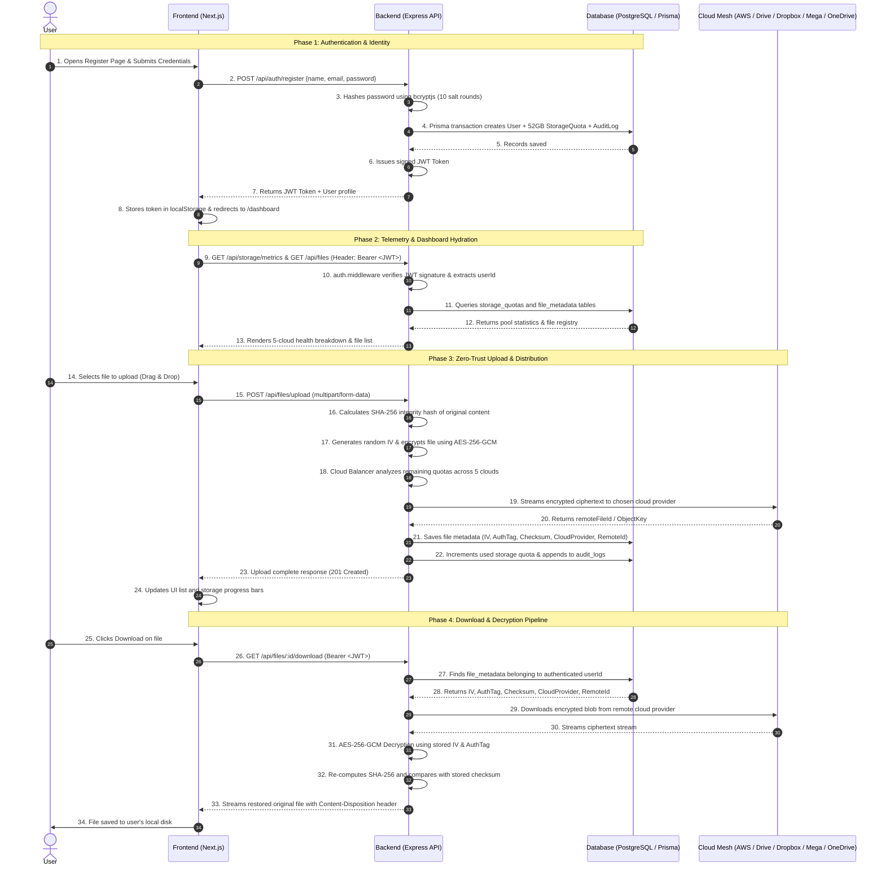

# 🌐 CloudFusion Multi-Cloud Architecture & Communication Guide
## End-to-End Lifecycle: Frontend, Backend, Database, and 5-Cloud Storage Mesh

---

## 📌 1. System Architecture Overview

The system is designed on a **Three-Tier Architecture with a Zero-Trust Multi-Cloud Storage Mesh**. It enables users to combine multiple free-tier cloud accounts (**AWS S3, Google Drive, Dropbox, MEGA, and Microsoft OneDrive**) into a single unified virtual storage drive of **52 GB**, with end-to-end authenticated encryption.

```
+-------------------------------------------------------------------------------+
|                             CLIENT TIER (Frontend)                            |
|             Next.js 14 (App Router) + TypeScript + Tailwind CSS               |
|             Landing Page (/) | Register (/register) | Login (/login)          |
|                 User Dashboard (/dashboard) | Admin Console (/admin)          |
+---------------------------------------+---------------------------------------+
                                        |
                            HTTP/REST + JWT Bearer
                                        |
+---------------------------------------v---------------------------------------+
|                             API TIER (Backend)                                |
|                        Node.js + Express + TypeScript                         |
|  +-------------------------------------------------------------------------+  |
|  | Security Middleware (Helmet, CORS, Rate Limit, Auth JWT, Admin Role)    |  |
|  +-------------------------------------------------------------------------+  |
|  | Controllers (Auth, File, Storage, Admin)                               |  |
|  +-------------------------------------------------------------------------+  |
|  | Cryptographic Engine: AES-256-GCM + SHA-256 Checksums                   |  |
|  +-------------------------------------------------------------------------+  |
|  | Intelligent Cloud Balancer & Quota Distributor                          |  |
|  +-------------------------------------------------------------------------+  |
+-------------------+---------------------------------------+-------------------+
                    |                                       |
          Prisma ORM (SQL)                        Cloud APIs (OAuth / SDK)
                    |                                       |
+-------------------v-------------------+   +---------------v-------------------+
|          DATABASE TIER                |   |       DISTRIBUTED STORAGE MESH    |
|       PostgreSQL (Supabase)           |   |       (Pure Ciphertext Blobs)     |
|  - users                              |   |  1. AWS S3 (5 GB)                 |
|  - storage_quotas (52 GB pool)        |   |  2. Google Drive (15 GB)          |
|  - file_metadata (IV, Tag, Cloud ID)  |   |  3. Dropbox (2 GB)                |
|  - cloud_accounts (OAuth tokens)      |   |  4. MEGA Cloud (20 GB)            |
|  - audit_logs (Complete audit trail)  |   |  5. Microsoft OneDrive (10 GB)    |
+---------------------------------------+   +-----------------------------------+
```

---

## 🔄 2. End-to-End Sequence Diagram



---

## 📋 3. Detailed Step-by-Step Walkthrough

### Phase 1: Landing Page (`/`)
1. **User Action**: The client navigates to `http://localhost:3000/`.
2. **Frontend Logic**:
   - Next.js renders `src/app/page.tsx`.
   - The client checks `localStorage.getItem('token')`.
   - If a valid token exists, the navigation automatically suggests **"Go to Dashboard"**.
   - If no token exists, **"Get Started"** and **"Sign In"** buttons route to `/register` or `/login`.

---

### Phase 2: Registration (`/register`) & Login (`/login`)
1. **User Input**: The user supplies Full Name, Email, and Master Password.
2. **Frontend Dispatch**:
   - The form triggers `POST /api/auth/register` with JSON body `{ name, email, password }`.
3. **Backend Security Operations**:
   - Path: `backend/src/controllers/auth.controller.ts`
   - Checks if email is already taken via `prisma.user.findUnique({ where: { email } })`.
   - Generates a cryptographic salt and hashes the plaintext password via `bcrypt.hash(password, 10)`. Plaintext passwords **never** reach the database.
4. **Database Insertion (Prisma Transaction)**:
   - **`users` table**: Stores `id (UUID)`, `email`, `passwordHash`, `name`, `role: USER`.
   - **`storage_quotas` table**: Initializes user quota to **52 GB** (`55,834,574,848 bytes`), allocating metrics for S3, GDrive, Dropbox, Mega, and OneDrive.
   - **`audit_logs` table**: Records action `USER_REGISTER`.
5. **JWT Token Issuance**:
   - Backend signs a JSON Web Token with `JWT_SECRET`:
     ```json
     { "userId": "uuid-1234", "role": "USER", "iat": 1725345600, "exp": 1725950400 }
     ```
6. **Frontend Session Storage**:
   - The frontend receives `{ token, user }`.
   - Saves token into browser `localStorage`.
   - Redirects user to `/dashboard`.

---

### Phase 3: Protected Request Gateway (Middleware)
For **every subsequent request** (upload, download, list, delete, metrics):
1. **Frontend Request Interceptor**:
   - Attaches the header: `Authorization: Bearer <token>`.
2. **Backend Auth Middleware** (`backend/src/middleware/auth.middleware.ts`):
   - Extracts the token from the header.
   - Verifies token signature with `jwt.verify(token, JWT_SECRET)`.
   - Populates `req.user = { id, email, role }`.
   - If token is missing, expired, or tampered with, immediately terminates with `HTTP 401 Unauthorized`.
3. **Admin Guard** (`backend/src/middleware/admin.middleware.ts`):
   - For `/api/admin/*` endpoints, inspects `req.user.role === 'ADMIN'`. Non-admins are rejected with `HTTP 403 Forbidden`.

---

### Phase 4: Dashboard Initialization (`/dashboard`)
1. **Telemetry Retrieval**:
   - Frontend triggers two parallel requests:
     - `GET /api/storage/metrics`
     - `GET /api/files`
2. **Backend Processing**:
   - Reads `storage_quotas` table for `req.user.id`.
   - Calculates aggregate statistics across AWS S3, Google Drive, Dropbox, MEGA, and OneDrive.
   - Retrieves active files from `file_metadata` where `userId = req.user.id` and `status = ACTIVE`.
3. **Frontend Rendering**:
   - Renders interactive storage donut graphs and progress bars showing:
     - Total mesh capacity (52 GB pooled).
     - Used vs. remaining space per cloud provider.
     - Recent files list with status badges and provider icons.

---

### Phase 5: Zero-Trust File Upload Pipeline (Single & Multi-File Queue)
When the user drags and drops or selects one or multiple files:

1. **Multi-File Queue & Dispatch**:
   - The UI supports selecting multiple files or dropping a batch of files via `<input type="file" multiple />`.
   - The frontend converts the file batch into an asynchronous processing queue.
   - For each file, an individual tracking item is registered in `uploadItems` with real-time percentage indicators.
   - Files are processed through an orchestrated pipeline with step-by-step modal telemetry (`Encrypting -> Hashing -> Streaming to Cloud Provider`).
   - Dispatches each file as `multipart/form-data` to `POST /api/files/upload`.
2. **Multer Buffer Handling**:
   - Backend receives the file stream into secure memory buffers.
3. **Cryptographic Integrity & Encryption** (`backend/src/services/crypto.service.ts`):
   - **Step A (Integrity)**: Computes a `SHA-256` hash of the plaintext file bytes. This becomes the immutable fingerprint for verifying data integrity later.
   - **Step B (Cipher)**: Generates a cryptographically random 12-byte **Initialization Vector (IV)**.
   - **Step C (AES-256-GCM)**: Encrypts the raw file buffer using AES-256 in Galois/Counter Mode (GCM).
   - **Step D (Auth Tag)**: Extracts the 16-byte **Authentication Tag** (`authTag`), which guarantees the ciphertext cannot be modified or forged in the cloud.
4. **Intelligent Multi-Cloud Load Balancing** (`backend/src/services/storage/cloudBalancer.service.ts`):
   - The balancer queries user quotas and provider health.
   - It checks:
     - Is AWS S3 within its 5 GB limit?
     - Is Google Drive within its 15 GB limit?
     - Is Dropbox within its 2 GB limit?
     - Is MEGA within its 20 GB limit?
     - Is OneDrive within its 10 GB limit?
   - Chooses the optimal provider using dynamic quota optimization or round-robin failover.
5. **Cloud Transmission**:
   - The backend storage adapter (e.g. `s3.service.ts`, `gdrive.service.ts`, `dropbox.service.ts`, `mega.service.ts`, or `onedrive.service.ts`) uploads the **encrypted ciphertext buffer** to the target cloud provider API.
   - The remote provider stores only unreadable ciphertext and returns a `remoteFileId`.
6. **Database Persistence (`Prisma.$transaction`)**:
   - Writes to `file_metadata`:
     - `userId`: owner's UUID.
     - `originalName`: original filename.
     - `mimeType`: file MIME type.
     - `sizeBytes`: original size.
     - `encryptedSizeBytes`: ciphertext size.
     - `checksumSHA256`: original hash.
     - `aesInitializationVector`: hex-encoded IV.
     - `aesAuthTag`: hex-encoded GCM authentication tag.
     - `cloudProvider`: e.g. `AWS_S3`, `GOOGLE_DRIVE`, `DROPBOX`, `MEGA`, `ONEDRIVE`.
     - `remoteFileId`: cloud provider's remote object ID.
   - Updates `storage_quotas`: increments `usedQuotaBytes` and the provider's used byte field.
   - Records `FILE_UPLOAD` in `audit_logs`.
7. **Frontend State Refresh**:
   - Backend returns `201 Created` with file metadata.
   - Frontend prepends the new file to the UI table and animates the storage meter.

---

### Phase 6: Secure File Retrieval & Decryption Pipeline
When the user clicks the **Download** button:

1. **Frontend Request**: Calls `GET /api/files/:id/download`.
2. **Ownership & Record Lookup**:
   - Backend finds `file_metadata` where `id = :id` AND `userId = req.user.id`.
   - Prevents **IDOR** (Insecure Direct Object Reference) vulnerabilities — users can never access another user's file.
3. **Cloud Fetch**:
   - Looks up `cloudProvider` and `remoteFileId`.
   - Connects to the specific cloud provider and streams the encrypted blob down into the backend memory.
4. **Decryption & Tamper Check**:
   - Initializes AES-256-GCM decipher using the system encryption key, the stored `aesInitializationVector`, and `aesAuthTag`.
   - Decrypts ciphertext back to plaintext.
   - Recalculates `SHA-256` of the decrypted buffer.
   - Compares the result against `checksumSHA256`:
     - **Match**: File is authentic and uncompromised.
     - **Mismatch**: Throws error, rejecting corrupt or tampered data.
5. **Stream to Client**:
   - Sends the file stream to the browser with headers:
     ```http
     Content-Type: <mimeType>
     Content-Disposition: attachment; filename="<originalName>"
     ```
   - Appends `FILE_DOWNLOAD` to `audit_logs`.

---

### Phase 7: File Deletion & Quota Reclaiming
When the user clicks **Delete**:
1. **Frontend**: Sends `DELETE /api/files/:id`.
2. **Remote Purge**: Backend calls the respective cloud provider API to delete the remote object.
3. **Database Adjustment**:
   - Sets `status = DELETED` (or deletes row) in `file_metadata`.
   - Subtracts file size from `storage_quotas`.
   - Records `FILE_DELETE` in `audit_logs`.
4. **UI Update**: File disappears from the dashboard and reclaimed storage reflects immediately.

---

## 🛡️ 4. Data Storage & Privacy Matrix

| Data Item | Frontend Client | Backend Server RAM | PostgreSQL Database | Cloud Storage Providers |
| :--- | :---: | :---: | :---: | :---: |
| **User Password** | Transient form state | Hashed with bcrypt | `passwordHash` only | ❌ Never |
| **Plaintext File Content** | Rendered / downloaded | Ephemeral buffer during upload/download | ❌ Never stored | ❌ Never |
| **Encrypted File Ciphertext**| ❌ Never | Streaming buffer | ❌ Never stored | ✅ Stored (AES-256-GCM) |
| **Encryption IV & AuthTag**  | ❌ Never | Generated / consumed | ✅ Stored in `file_metadata` | ❌ Never |
| **Cloud API Credentials**   | ❌ Never | Decrypted in memory | ✅ Encrypted tokens in DB | ❌ Never |
| **Audit Logs**              | Read-only view | Appended per event | ✅ Stored in `audit_logs` | ❌ Never |

---

## 🎓 5. Project Defense Q&A Cheat Sheet

### Q1: What makes this architecture "Zero-Trust"?
> **Answer**: Even though files reside on third-party commercial clouds (AWS, Google, Dropbox, MEGA, Microsoft), none of those cloud providers can read or index user files. Files are encrypted with random initialization vectors (`IV`) and AES-256-GCM *before* transmission. The cloud providers only hold unreadable ciphertext.

### Q2: How does the system handle multi-cloud quota allocation?
> **Answer**: The backend implements an **Intelligent Cloud Balancer** (`cloudBalancer.service.ts`). It treats all 5 clouds as a single 52 GB virtual storage pool. When an upload occurs, the balancer checks current quota usage across all 5 providers and places the file onto the provider with the best availability and remaining capacity.

### Q3: How do you prevent data tampering in the cloud?
> **Answer**: We use **AES-256-GCM**, which provides Authenticated Encryption with Associated Data (AEAD). The generated 16-byte authentication tag detects any bit flipping or tampering. Additionally, we compute a `SHA-256` checksum before encryption and verify it after decryption to guarantee bit-for-bit file integrity.

### Q4: How is multi-user data isolation enforced?
> **Answer**: In the database schema, every record in `file_metadata`, `storage_quotas`, and `audit_logs` has a foreign key `userId` referencing the `users` table with strict cascading constraints. All backend endpoints authenticate requests via JWT and scope SQL queries strictly to `where: { userId: req.user.id }`.
